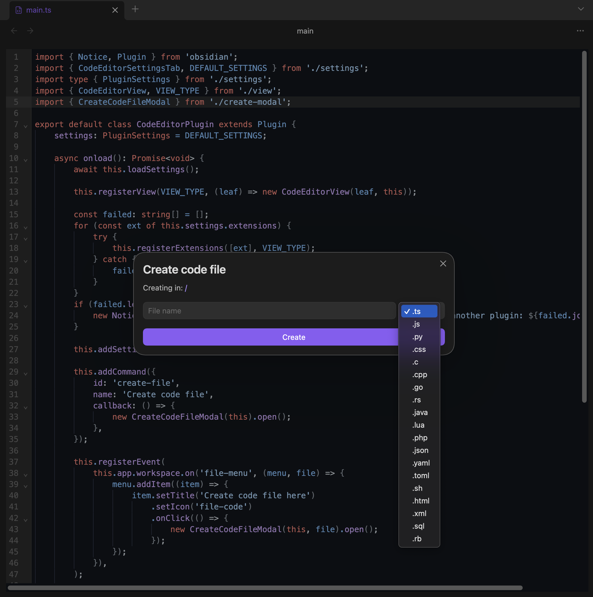
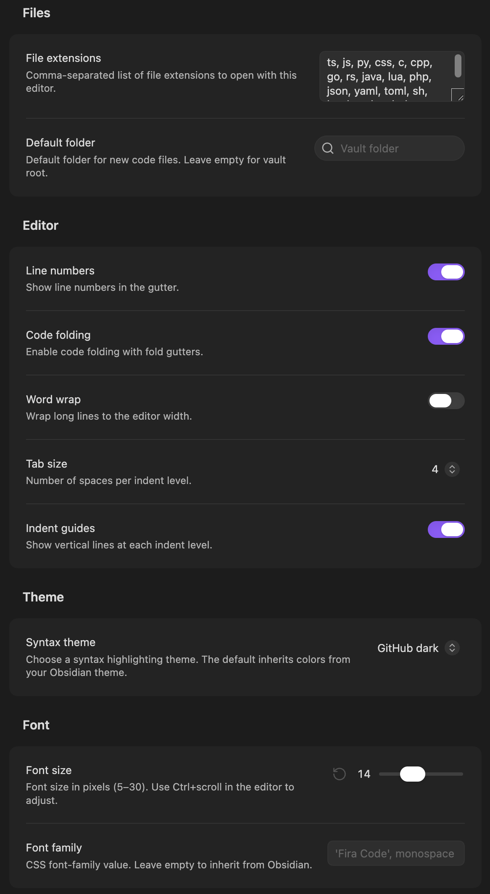

# CM Code Editor

Edit code files in your [Obsidian](https://obsidian.md) vault with syntax highlighting, code folding, search and replace, and autocompletion. Built on [CodeMirror 6](https://codemirror.net/).

| Editor and create file dialog           | Settings                                           |
| --------------------------------------- | -------------------------------------------------- |
|  |  |

> [!NOTE]
> Requires Obsidian 1.13.0 or later.

## Features

- Syntax highlighting for 24 languages, from Python and TypeScript to Rust, Go, and Swift
- 45 color themes, or colors that follow your Obsidian theme
- Search and replace with match case, regex, and whole word options
- Code folding, indent guides, line numbers, and word wrap
- Autocompletion, bracket matching, and auto-closing brackets
- Multiple cursors and rectangular selection
- Zoom with Ctrl/Cmd+scroll
- Create code files from the command palette or file explorer
- Rename a file including its extension, which Obsidian's own rename can't do
- Full file names in tabs, so `app.ts` and `app.js` are easy to tell apart

**New here? Read the [user guide](USER-GUIDE.md).** It covers every feature, setting, and shortcut.

## Installation

### From Obsidian

1. Open **Settings → Community plugins → Browse**.
2. Search for "CM Code Editor".
3. Select **Install**, then **Enable**.

Or install it from [community.obsidian.md](https://community.obsidian.md/plugins/cm-code-editor).

### Manually

1. Download `main.js`, `manifest.json`, and `styles.css` from the [latest release](https://github.com/gapmiss/cm-code-editor/releases/latest).
2. Create the folder `.obsidian/plugins/cm-code-editor` inside your vault.
3. Move the three files into it.
4. In **Settings → Community plugins**, reload the installed plugins list and enable CM Code Editor.

## Quick start

Files with these extensions open in the code editor right away:

`c` `cpp` `css` `go` `html` `java` `js` `json` `lua` `php` `py` `rb` `rs` `sh` `sql` `toml` `ts` `xml` `yaml`

To add more, edit **File extensions** in the plugin settings, then turn the plugin off and on again. The [user guide](USER-GUIDE.md#supported-languages) lists every extension with highlighting.

## Contributing

See [CONTRIBUTING.md](CONTRIBUTING.md).

## License

[MIT](LICENSE)
